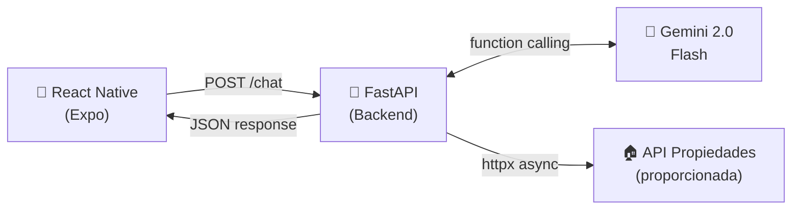
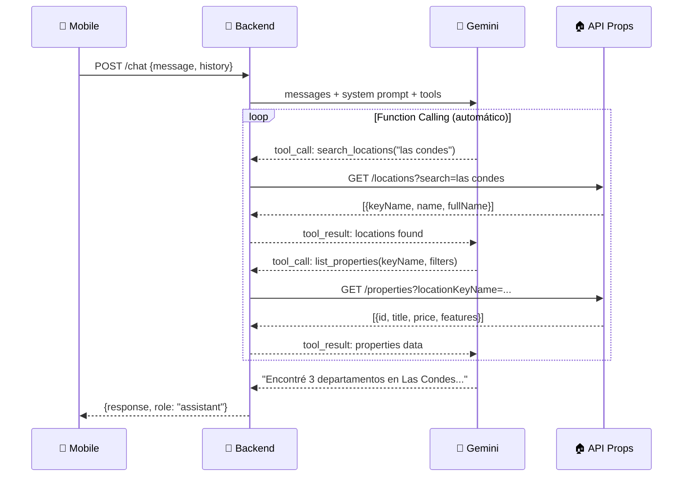
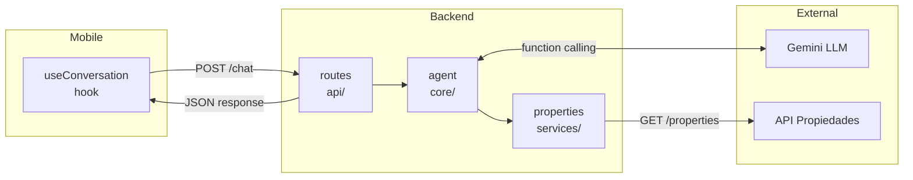
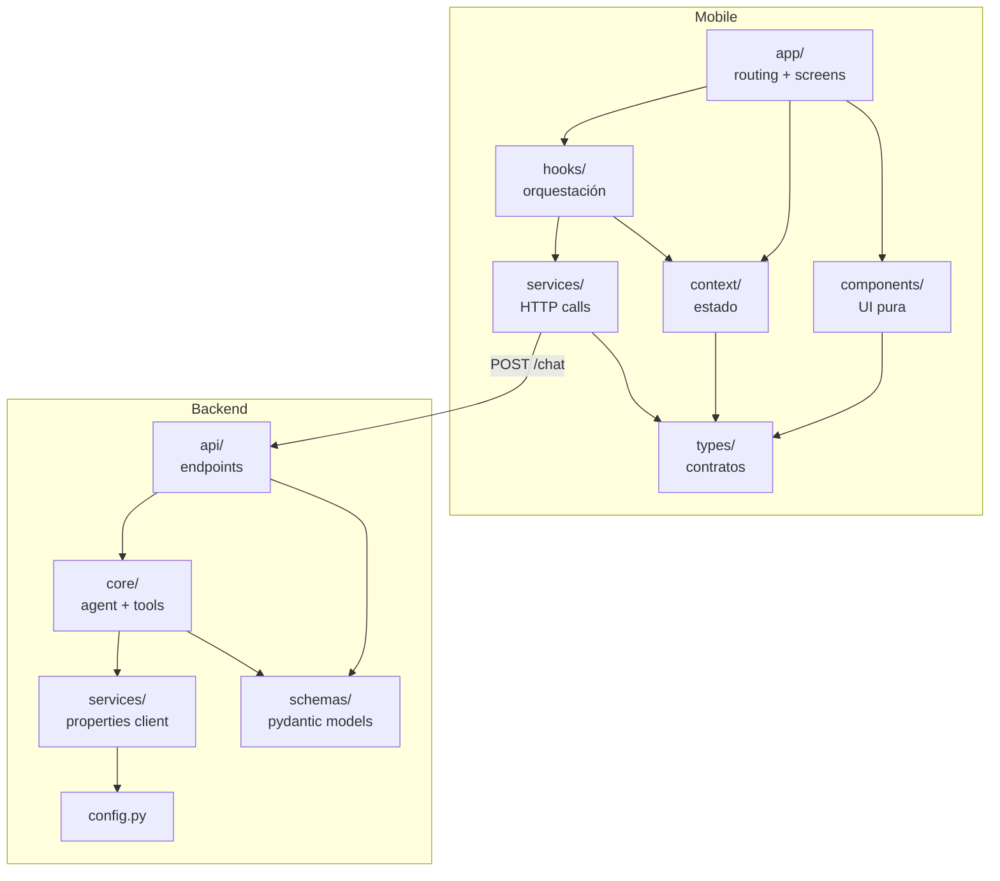
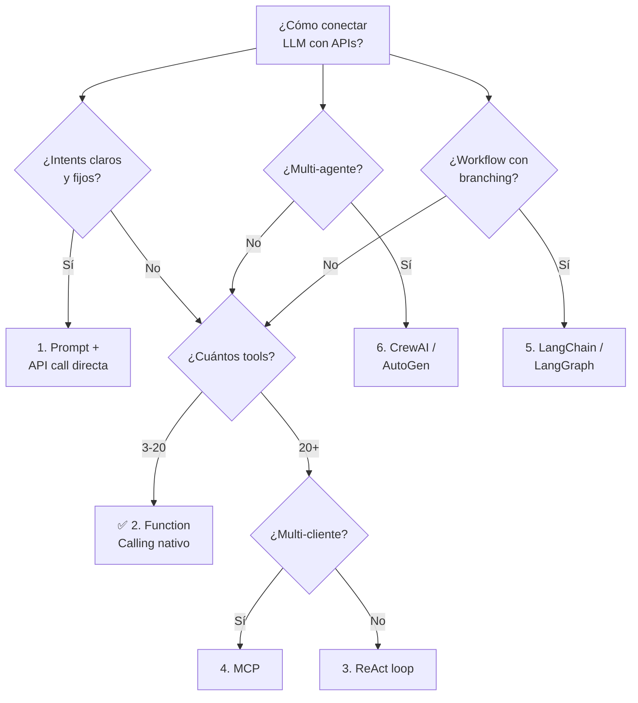
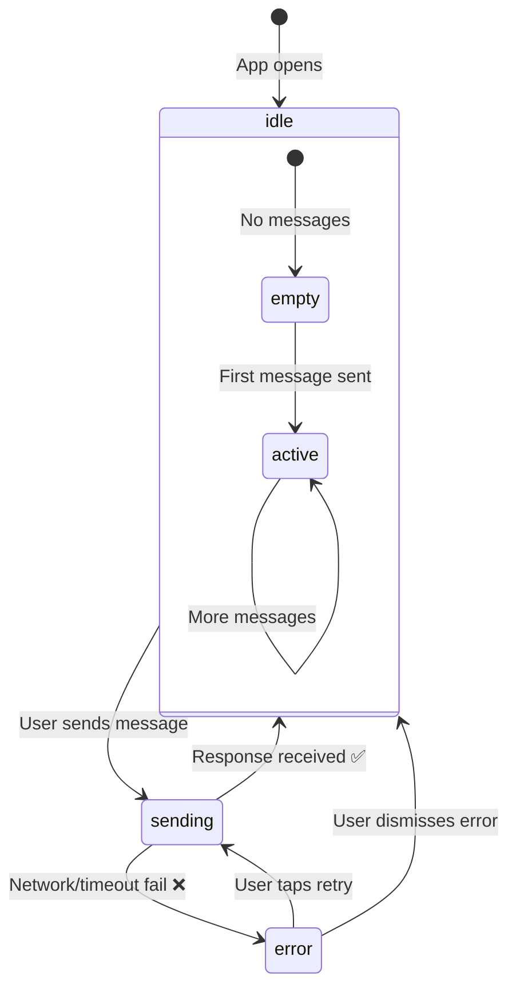
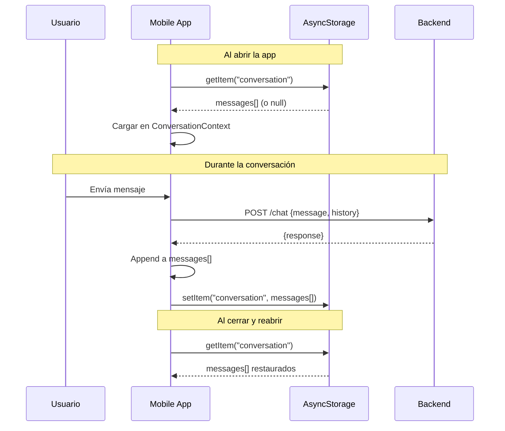
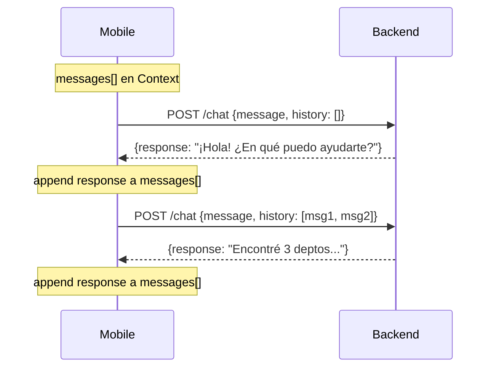

# PropAssist AI — Plan de Implementación

## Índice

1. [Extensiones de VSCode Recomendadas](#extensiones-de-vscode-recomendadas)
2. [Arquitectura General](#arquitectura-general)
3. [Stack Técnico](#stack-técnico)
4. [Arquitectura de Dominio](#arquitectura-de-dominio)
   - [Mobile — Layered by Concern](#mobile--layered-by-concern)
   - [Backend — Layered Architecture](#backend--layered-architecture)
   - [Naming Conventions](#naming-conventions)
5. [Por qué Function Calling y no MCP ni otras alternativas](#por-qué-function-calling-y-no-mcp-ni-otras-alternativas)
6. [Diseño del Backend (Agente con Tools)](#diseño-del-backend-agente-con-tools)
7. [Diseño del Frontend](#diseño-del-frontend)
8. [Persistencia de Conversación](#persistencia-de-conversación)
9. [Paquetes a Instalar](#paquetes-a-instalar)
10. [Plan de Ejecución](#plan-de-ejecución-orden)
11. [Checklist de Entregables](#checklist-de-entregables-vs-requerimientos)
12. [Mejoras Futuras](#qué-mejorarías-con-1-semana-más-borrador-para-readme)
13. [Justificación Arquitectónica](#justificación-arquitectónica)
14. [LLM: Por qué Gemini 2.0 Flash](#llm-por-qué-gemini-20-flash)
15. [Bibliografía](#bibliografía)

---

## Extensiones de VSCode Recomendadas

Extensiones para trabajar eficientemente en este proyecto — visualizar diagramas Mermaid, desarrollar el frontend mobile, y testear el backend.

### Esenciales

| Extensión | Marketplace ID | Para qué |
|-----------|----------------|----------|
| **Markdown Preview Mermaid** | `bierner.markdown-mermaid` | Renderiza diagramas Mermaid dentro del preview nativo de Markdown (`Ctrl+Shift+V`). Ideal para visualizar los diagramas de PLAN.md y BACKEND.md sin salir de VSCode |
| **Expo Tools** | `expo.vscode-expo-tools` | Extensión oficial de Expo. Autocompletado para `app.json`, integración con Expo CLI, y manejo de configuración |
| **React Native Tools** | `msjsdiag.vscode-react-native` | Extensión de Microsoft para debugging de React Native. Acceso rápido a comandos de Expo desde la paleta de comandos |
| **Python** | `ms-python.python` | Soporte base de Python: linting, formatting, IntelliSense |

### Recomendadas

| Extensión | Marketplace ID | Para qué |
|-----------|----------------|----------|
| **REST Client** | `humao.rest-client` | Enviar requests HTTP directamente desde VSCode. Útil para testear `POST /chat` y `/health` sin usar curl |
| **Markdown Preview Enhanced** | `shd101wyy.markdown-preview-enhanced` | Preview de Markdown avanzado con soporte nativo de Mermaid, export a PDF, y scroll sync |
| **Pretty TypeScript Errors** | `yoavbls.pretty-ts-errors` | Hace legibles los errores de TypeScript complejos de React Native |

### Instalación rápida

```bash
# Esenciales
code --install-extension bierner.markdown-mermaid
code --install-extension expo.vscode-expo-tools
code --install-extension msjsdiag.vscode-react-native
code --install-extension ms-python.python

# Recomendadas
code --install-extension humao.rest-client
code --install-extension shd101wyy.markdown-preview-enhanced
code --install-extension yoavbls.pretty-ts-errors
```

> **Tip**: Para ver los diagramas Mermaid de este archivo, abre el preview de Markdown con `Ctrl+Shift+V` (con `bierner.markdown-mermaid` instalado).

---

## Arquitectura General



### Concepto Clave: LLM como Agente con Function Calling

En lugar de parsear manualmente la intención del usuario, **Gemini actúa como agente** con 3 herramientas (tools) que mapean directamente a los endpoints de la API de propiedades:

1. **`search_locations`** → `GET /locations` — busca ubicaciones por texto
2. **`list_properties`** → `GET /properties` — lista propiedades con filtros
3. **`get_property_detail`** → `GET /properties/{id}` — detalle de una propiedad

El LLM decide autónomamente cuándo llamar cada tool según el mensaje del usuario. Esto elimina lógica de parsing manual y hace el sistema extensible.

### Flujo del Agente (Sequence)



---

## Stack Técnico

### Frontend — `/mobile`

| Componente       | Elección                | Justificación                                                    |
|------------------|-------------------------|------------------------------------------------------------------|
| **Framework**    | Expo SDK 52+            | Requerido. Stable, bien soportado                                |
| **Router**       | Expo Router v4          | Requerido. File-based routing                                    |
| **Estilos**      | StyleSheet (built-in)    | 0 config, 0 riesgo compatibilidad. NativeWind v4 tiene issues con RN 0.77+/Expo SDK 52+ [22]. Para 5 componentes la ganancia de DX no justifica el riesgo de setup. El tiempo se invierte en UX (25% de evaluación) |
| **Estado**       | Context API + useReducer | Built-in React, 0 dependencias. Para 1 pantalla con 3 estados (messages, loading, error) una librería externa es overkill. Zustand/Redux justifican su peso en apps multi-pantalla con estado complejo — no es este caso |
| **HTTP**         | Custom hook + fetch      | TanStack Query brilla en queries con caching/refetch/pagination. Un chat es mutations fire-and-forget sin caché — TQ no agrega valor aquí. Un hook `useChatApi` con fetch nativo da control total y 0 dependencias |
| **TypeScript**   | Obligatorio             | Requerido                                                        |
| **Chat UI**      | Componentes custom      | Control total sobre UX, evita dependencias pesadas               |

### Backend — `/backend`

| Componente       | Elección                | Justificación                                                    |
|------------------|-------------------------|------------------------------------------------------------------|
| **Framework**    | FastAPI (Python 3.11+)  | Requerido. Async nativo, auto-docs                               |
| **LLM**          | Gemini 2.0 Flash        | **Gratis** (1500 req/día), function calling nativo, baja latencia |
| **LLM SDK**      | `google-genai`          | SDK oficial nuevo de Google (reemplaza google-generativeai)      |
| **HTTP Client**  | httpx                   | Async, moderno, excelente API                                    |
| **Validación**   | Pydantic v2             | Requerido. Request/response models                               |
| **CORS**         | FastAPI middleware       | Para comunicación con la app mobile                              |

---

## Arquitectura de Dominio

### Principios

- **Separación por capas**, no por tipo de archivo — cada capa tiene una responsabilidad clara
- **Naming en inglés** consistente — sin mezclar idiomas ni redundancias (`MessageBubble`, no `ChatMessageBubble`)
- **Sin prefijos redundantes** — si ya estás en `/components`, no necesitas `ChatComponent`. El contexto del directorio ya lo dice
- **Single Responsibility** — un archivo, una responsabilidad. Sin archivos "god" que hacen todo

---

### Mobile — Layered by Concern

```
mobile/
├── app/                          # ROUTING LAYER — solo navegación (Expo Router)
│   ├── _layout.tsx               #   Root layout (providers, safe area, status bar)
│   └── index.tsx                 #   Pantalla principal — compone los componentes
│
├── components/                   # PRESENTATION LAYER — UI pura, sin lógica de negocio
│   ├── MessageBubble.tsx         #   Burbuja individual (renderiza user vs assistant)
│   ├── MessageList.tsx           #   FlatList de mensajes con auto-scroll
│   ├── InputBar.tsx              #   TextInput + botón enviar
│   ├── TypingIndicator.tsx       #   Dots animados "escribiendo..."
│   ├── SuggestionChips.tsx       #   Chips de sugerencias rápidas ("Buscar en Las Condes")
│   └── Header.tsx                #   Header con título + botón "Nueva conversación"
│
├── context/                      # STATE LAYER — estado global de la app
│   └── ConversationContext.tsx   #   useReducer: messages[], isLoading, error
│
├── hooks/                        # LOGIC LAYER — lógica reutilizable
│   └── useConversation.ts        #   Orquesta: enviar mensaje, manejar respuesta, errores
│
├── services/                     # INFRASTRUCTURE LAYER — comunicación externa
│   └── assistant.ts              #   POST /chat con timeout, abort, error handling
│
├── types/                        # CONTRACTS — tipos compartidos
│   └── conversation.ts           #   Message, Role, ConversationRequest, ConversationResponse
│
├── constants/
│   └── config.ts                 #   BACKEND_URL, TIMEOUT_MS
│
├── app.json
├── package.json
└── tsconfig.json
```

**Por qué esta estructura:**

| Capa              | Responsabilidad                    | Depende de           |
|-------------------|------------------------------------|----------------------|
| `app/`            | Routing + composición de pantalla  | components, context  |
| `components/`     | Render UI (props in, JSX out)      | types                |
| `context/`        | Estado de la conversación          | types                |
| `hooks/`          | Orquestación de lógica             | context, services    |
| `services/`       | HTTP calls al backend              | types, constants     |
| `types/`          | Contratos de datos                 | nada                 |

> Los componentes NUNCA llaman servicios. Los hooks orquestan. Las screens componen.

---

### Backend — Layered Architecture

```
backend/
├── app/
│   ├── main.py                   # Entry point — FastAPI app, CORS, lifespan
│   │
│   ├── api/                      # PRESENTATION LAYER — endpoints HTTP
│   │   └── routes.py             #   POST /chat — recibe request, retorna response
│   │
│   ├── core/                     # DOMAIN LAYER — lógica de negocio + IA
│   │   ├── agent.py              #   Orquestador: Gemini + function calling loop
│   │   ├── prompts.py            #   System prompt del asistente inmobiliario
│   │   └── tools.py              #   Definición de tools (schemas para Gemini)
│   │
│   ├── services/                 # INFRASTRUCTURE LAYER — integraciones externas
│   │   └── properties.py         #   Client HTTP: GET /properties, /locations (API proporcionada)
│   │
│   ├── schemas/                  # CONTRACTS — Pydantic models
│   │   └── conversation.py       #   ChatRequest, ChatResponse, Message, Role
│   │
│   └── config.py                 # Settings — env vars, URLs, API keys
│
├── requirements.txt
├── .env.example
└── .env
```

**Por qué esta estructura:**

| Capa              | Responsabilidad                          | Depende de           |
|-------------------|------------------------------------------|----------------------|
| `api/`            | HTTP interface (request → response)      | schemas, core        |
| `core/`           | Lógica IA: agent loop, prompts, tools    | services, schemas    |
| `services/`       | Llamadas a API externa de propiedades    | schemas, config      |
| `schemas/`        | Pydantic models (contratos de datos)     | nada                 |
| `config.py`       | Variables de entorno                     | nada                 |

> La ruta del endpoint (`api/`) solo llama al agent (`core/`). El agent usa los tools que llaman services. Cada capa solo conoce la siguiente.

---

### Flujo de datos end-to-end



### Dependency Graph (capas)



---

### Naming Conventions

| Concepto              | Mobile (TS)               | Backend (Python)          |
|-----------------------|---------------------------|---------------------------|
| Mensaje individual    | `Message`                 | `Message`                 |
| Rol del mensaje       | `Role` (`user`, `assistant`) | `Role` (`user`, `assistant`) |
| Request al backend    | `ConversationRequest`     | `ChatRequest`             |
| Response del backend  | `ConversationResponse`    | `ChatResponse`            |
| Estado del chat       | `ConversationState`       | —                         |
| Acciones del reducer  | `ConversationAction`      | —                         |

> Vocabulario consistente: "conversation" en mobile (es el dominio del usuario), "chat" en backend (es el contrato del endpoint). `Message` y `Role` son universales.

---

### Estructura raíz

```
/
├── mobile/           # React Native + Expo
├── backend/          # Python + FastAPI
├── README.md         # Documentación principal
└── PLAN.md           # Este documento
```

---

## Por qué Function Calling y no MCP ni otras alternativas

### El problema

Nuestro backend necesita que el LLM consulte 3 endpoints REST según lo que pida el usuario. Existen 6 patrones arquitectónicos para resolver esto en 2025-2026:



### Comparación de los 6 patrones

| Patrón | Complejidad | Latencia | Costo | Flexibilidad | ¿Para este proyecto? |
|--------|-------------|----------|-------|--------------|----------------------|
| **1. Prompt + API call** | Muy baja | Mínima | Mínimo | Baja | ❌ Intents ambiguos ("busco algo lindo en Las Condes") |
| **2. Function Calling** | Baja | Baja | Bajo | Media | ✅ **Nuestra elección** |
| **3. ReAct loop** | Media | Media | Medio | Alta | ❌ No necesitamos razonamiento iterativo |
| **4. MCP** | Media-Alta | Baja-Media | Bajo | Muy alta | ❌ Overkill para 3 tools de uso privado |
| **5. LangGraph** | Alta | Media | Medio | Muy alta | ❌ No hay workflow con branching |
| **6. CrewAI / AutoGen** | Alta | Alta | Alto | Alta | ❌ No hay múltiples agentes colaborando |

### Por qué Function Calling (Patrón 2) y no los otros

#### ❌ Patrón 1: Prompt + API call directa
Requiere routing manual (`if "departamento" in message → call /properties`). Esto es **frágil**: "busco algo lindo en Providencia con terraza" no matchea ningún keyword simple. El LLM es mejor interpretando intención natural que un `if/else` [26][27].

#### ✅ Patrón 2: Function Calling nativo (nuestra elección)
- El LLM recibe los schemas de 3 tools y decide autónomamente cuál llamar y con qué parámetros.
- Puede encadenar calls: `search_locations("las condes")` → `list_properties(keyName, filters)` → `get_property_detail(id)` en una sola conversación.
- **50-200 líneas de código**, 0 frameworks externos, 0 dependencias extra.
- Gemini 2.0 Flash tiene function calling nativo y gratuito [23][24].
- Es el patrón que Anthropic recomienda como baseline: "augmented LLM" [26].

#### ❌ Patrón 3: ReAct (Reasoning + Acting)
ReAct agrega un loop de `Thought → Action → Observation → Thought...` donde el LLM razona explícitamente antes de cada acción. Es poderoso para tareas de investigación multi-paso, pero **para 3 endpoints conocidos es overhead innecesario** — function calling ya maneja la secuenciación [28][29].

#### ❌ Patrón 4: MCP (Model Context Protocol)
MCP es un **protocolo estándar** (creado por Anthropic, donado a la Linux Foundation en dic. 2025) que estandariza cómo los LLMs descubren y usan herramientas. Requiere levantar un **MCP Server** como proceso separado con JSON-RPC 2.0 [30][31][32].

**Por qué no MCP para este proyecto:**

| Aspecto | Function Calling | MCP |
|---------|-----------------|-----|
| Setup | 3 schemas JSON inline | Servidor MCP separado + config + transport |
| Arquitectura | Single-process | Client-server (JSON-RPC 2.0) |
| Descubrimiento de tools | Estático (definidos en código) | Dinámico (runtime discovery) |
| Multi-cliente | No (un solo backend) | Sí (Claude, ChatGPT, Cursor...) |
| Complejidad | ~100 líneas | ~500+ líneas + proceso adicional |

MCP justifica su complejidad cuando: (a) los tools se reutilizan en múltiples clientes IA, (b) hay 10+ tools, o (c) se necesita descubrimiento dinámico [33][34]. **Ninguna aplica aquí** — tenemos 1 backend, 3 tools, uso privado.

> *"MCP introduces protocol overhead that only pays off when AI agents autonomously discover and invoke tools at runtime. For most integration work, this complexity is unnecessary."* — NoCodeAPI [35]

> *"Find the simplest solution possible, and only increase complexity when needed."* — Anthropic Engineering [26]

#### ❌ Patrón 5: LangChain / LangGraph
LangGraph modela workflows como grafos dirigidos con nodos (LLM calls, tool execution) y edges condicionales. Excelente para pipelines complejos con branching, retry logic, y approval gates [36][37]. **Para 3 tools sin branching, es como usar un cañón para matar una mosca.** Además agrega una dependencia pesada y una curva de aprendizaje innecesaria.

#### ❌ Patrón 6: CrewAI / AutoGen (Multi-Agent)
Frameworks para múltiples agentes especializados que colaboran (ej: "Investigador" + "Escritor" + "Revisor"). **No tenemos múltiples agentes** — tenemos un solo asistente que consulta una API. AutoGen además está en maintenance mode desde finales 2025 [38][39].

### Resumen: Árbol de decisión aplicado

```
¿Los intents son claros y no ambiguos? → NO (lenguaje natural libre)
  → ¿Cuántos tools? → 3
    → ¿Se necesita razonamiento multi-paso iterativo? → NO
      → ¿Los tools se reutilizan en múltiples clientes IA? → NO
        → ¿Hay workflow con branching complejo? → NO
          → ✅ FUNCTION CALLING NATIVO
```

---

## Diseño del Backend (Agente con Tools)

### System Prompt (`prompts.py`)

```
Eres PropAssist AI, un asistente inmobiliario profesional y amigable.
Tu rol es ayudar a clientes a encontrar propiedades según sus necesidades.

Reglas:
- Responde SIEMPRE en español
- Usa los datos reales de las propiedades (nunca inventes)
- Si no encuentras propiedades, sugiere alternativas (ampliar zona, presupuesto, etc.)
- Sé conciso pero informativo: menciona precio, ubicación, dormitorios, m²
- Ofrece dar más detalles o conectar con un agente
- Mantén un tono profesional pero cercano
```

### Tools (Function Calling)

```python
# Tool 1: search_locations
# Params: country_id, search_text, location_type
# → Llama GET /locations y retorna keyNames

# Tool 2: list_properties
# Params: location_key_name, type, operation, bedrooms_min, price_max, currency_id
# → Llama GET /properties y retorna resumen de propiedades

# Tool 3: get_property_detail
# Params: property_id
# → Llama GET /properties/{id} y retorna detalle completo
```

### Flujo del Agente

1. Usuario envía mensaje + historial → `POST /chat`
2. Backend construye mensajes con system prompt + historial + mensaje nuevo
3. Envía a Gemini con las 3 tools disponibles
4. Gemini decide si necesita llamar tools (puede llamar varias en secuencia)
5. Backend ejecuta las tool calls contra la API de propiedades
6. Retorna resultados al LLM para que genere respuesta final
7. Respuesta se envía al mobile

---

## Diseño del Frontend

### State Machine (ConversationContext)



### UX Decisions

- **Chat-first**: Una sola pantalla, foco total en la conversación
- **Burbujas diferenciadas**: User (derecha, color primario) vs AI (izquierda, gris claro)
- **Typing indicator**: 3 dots animados mientras la IA procesa
- **Auto-scroll**: Scroll automático al nuevo mensaje
- **Error handling**: Toast/banner inline si falla la red, con botón retry
- **Keyboard avoiding**: El input sube con el teclado
- **Safe area**: Respeta notch y barra inferior
- **Welcome message**: Mensaje de bienvenida del asistente al abrir
- **Suggestion chips**: Accesos rápidos ("Deptos en Las Condes", "Casas en arriendo")
- **Haptic feedback**: Vibración sutil al enviar mensaje

### Paleta de colores (inspirada en real estate)

- Primary: `#2563EB` (azul profesional)
- AI bubble: `#F3F4F6` (gris claro)
- User bubble: `#2563EB` (azul)
- User text: `#FFFFFF`
- Background: `#FFFFFF`
- Error: `#EF4444`

---

## Persistencia de Conversación

### Estrategia: AsyncStorage en el mobile (0 cambios en backend)

El backend es **stateless** (como pide el enunciado). Pero la UX mejora enormemente si el usuario no pierde su conversación al cerrar la app. La solución: **persistir el array de mensajes en AsyncStorage**.



### Implementación

```typescript
// En ConversationContext.tsx — solo 2 efectos extra:

// 1. Cargar al montar
useEffect(() => {
  AsyncStorage.getItem('conversation')
    .then(data => data && dispatch({ type: 'LOAD', messages: JSON.parse(data) }));
}, []);

// 2. Persistir en cada cambio
useEffect(() => {
  AsyncStorage.setItem('conversation', JSON.stringify(state.messages));
}, [state.messages]);
```

### Por qué este approach

| Aspecto | AsyncStorage (client) | DB en backend |
|---------|----------------------|---------------|
| Líneas de código extra | ~10 | ~200+ (models, migrations, CRUD, session mgmt) |
| Backend sigue stateless | ✅ Sí | ❌ No |
| Cambios en backend | 0 | Nuevos endpoints, DB setup |
| UX | Conversación sobrevive al cerrar app | Misma UX + multi-device |
| Scope del MVP | ✅ Suficiente | Overkill |

**Trade-off**: Se pierde al desinstalar la app o limpiar datos. Para un MVP/demo es aceptable. La persistencia server-side queda documentada como mejora futura.

### Funcionalidad extra: botón "Nueva conversación"

Con persistencia local, necesitamos un botón para limpiar el historial e iniciar una nueva conversación. Un ícono en el header basta.

---

## Paquetes a Instalar

### Mobile (`/mobile`)

```bash
# Crear proyecto
npx create-expo-app mobile --template blank-typescript

# Core
npx expo install expo-router expo-linking expo-constants expo-status-bar react-native-safe-area-context react-native-screens

# Estilos: StyleSheet nativo (built-in, 0 config, 0 riesgo de compatibilidad)

# Estado: Context API + useReducer (built-in, 0 dependencias)

# Persistencia local
npx expo install @react-native-async-storage/async-storage

# Haptic feedback
npx expo install expo-haptics

# Utils
npm install react-native-reanimated
```

### Backend (`/backend`)

```txt
# requirements.txt
fastapi>=0.115.0
uvicorn[standard]>=0.32.0
google-genai>=1.0.0
httpx>=0.27.0
pydantic>=2.0.0
python-dotenv>=1.0.0
```

---

## Plan de Ejecución (Orden)

### Fase 1: Backend (hacer primero — permite testear con curl)
1. Scaffold FastAPI + configuración
2. Implementar `tools.py` — funciones que llaman la API de propiedades
3. Implementar `agent.py` — Gemini con function calling
4. Implementar `POST /chat` endpoint
5. Testear con curl/httpie

### Fase 2: Mobile
1. Scaffold Expo + Expo Router
2. Implementar tipos, Context + useReducer, y hook `useConversation`
3. Implementar servicio API (`assistant.ts` — POST /chat)
4. Implementar componentes de chat (MessageBubble, MessageList, InputBar, TypingIndicator, SuggestionChips)
5. Implementar pantalla principal (`index.tsx`) con toda la lógica
6. Pulir UX (animaciones, keyboard avoiding, safe area, haptic feedback)

### Fase 3: Documentación
1. README con setup instructions (mobile + backend)
2. Decisiones técnicas y trade-offs (justificación de cada elección)
3. Decisiones de UX (por qué cada decisión visual)
4. "¿Qué mejorarías con 1 semana más?" (ver sección abajo)

---

## Checklist de Entregables vs Requerimientos

```
✅ F1 — Chat conversacional (input, burbujas, auto-scroll)
✅ F2 — POST /chat con loading, timeout, error handling
✅ F3 — Typing indicator animado
✅ B1 — POST /chat recibe mensaje + historial
✅ B2 — Integración con API propiedades (3 endpoints via function calling)
✅ B3 — System prompt inmobiliario + contexto de propiedades
✅ Stack mobile: Expo SDK 52+, Expo Router, TypeScript, StyleSheet
✅ Stack backend: FastAPI, Python 3.11+, Pydantic v2, httpx, google-genai
✅ Estructura: /mobile + /backend + README.md
✅ Documentación: setup, decisiones técnicas, UX, mejoras futuras
```

---

## "¿Qué mejorarías con 1 semana más?" (borrador para README)

Esta sección vale 15% (documentación). Debe mostrar visión de producto y madurez técnica.

### Funcionalidad
- **Persistencia de conversaciones**: SQLite/PostgreSQL + session IDs para recuperar chats anteriores
- **Streaming de respuestas**: SSE (Server-Sent Events) para mostrar la respuesta token por token como ChatGPT, reduciendo perceived latency
- **Property cards**: Renderizar propiedades como cards visuales con imagen, precio y features en lugar de solo texto
- **Deep linking a propiedades**: Tap en una propiedad → pantalla de detalle con galería de imágenes
- **Multi-idioma**: Detectar idioma del usuario y responder en ese idioma

### Arquitectura
- **Migrar a Hexagonal**: Extraer interfaces (`LLMPort`, `PropertiesPort`) para swappear providers sin tocar la lógica
- **Rate limiting**: Proteger el endpoint POST /chat contra abuso
- **Caching de propiedades**: Redis/in-memory cache para evitar llamadas repetidas a la API externa
- **Observabilidad**: Logging estructurado + métricas de latencia por tool call
- **Tests**: Unit tests para el agent loop, integration tests para el endpoint

### UX
- **Onboarding**: Primera vez → tutorial breve mostrando qué puede hacer el asistente
- **Dark mode**: Soporte de tema oscuro
- **Accesibilidad**: Labels para screen readers, tamaños de fuente adaptables
- **Animations**: Transiciones más elaboradas con Reanimated (entrada de burbujas, scroll suave)

---

## LLM: Por qué Gemini 2.0 Flash

| Criterio    | Gemini 2.0 Flash                                         |
|-------------|-----------------------------------------------------------|
| **Costo**   | Gratis (1500 req/día, 15 req/min) — suficiente para demo  |
| **Calidad** | Excelente para conversación + function calling             |
| **Latencia**| ~1-2s respuesta, muy rápido para su categoría              |
| **Tools**   | Function calling nativo, bien documentado                  |
| **Spanish** | Buen soporte de español                                    |

Alternativas consideradas:
- **Groq (Llama 3.1)**: Gratis y muy rápido, pero function calling menos maduro
- **GPT-4o-mini**: Excelente calidad, pero requiere pago
- **Claude 3.5 Haiku**: Buena calidad, requiere API key de pago

---

## Justificación Arquitectónica

### 1. Backend: Layered Architecture (api → core → services)

Nuestra estructura separa el backend en 4 capas con dependencias unidireccionales:

```
api/ (presentation) → core/ (domain) → services/ (infrastructure) → config
                        ↕
                    schemas/ (contracts)
```

**Por qué esta y no flat structure:**
- El proyecto tiene un solo endpoint (`POST /chat`), pero la lógica interna es compleja: orquestación del agente, function calling loop, llamadas a API externa. Una estructura plana mezclaría HTTP handling con lógica de IA en un solo archivo.
- La separación permite testear el `agent` sin levantar FastAPI, y mockear `services/properties.py` sin tocar la lógica del LLM.
- Es la estructura recomendada para aplicaciones FastAPI de producción en 2025-2026 [1][2][3].

**Otras arquitecturas consideradas y cuándo escalar a ellas:**

| Arquitectura | Qué agrega sobre layered | Cuándo usarla | Para este MVP |
|---|---|---|---|
| **Hexagonal (Ports & Adapters)** | Interfaces abstractas entre capas. El dominio no conoce la infra (DB, HTTP, LLM) — solo define "ports" que la infra implementa | Cuando necesitas swappear implementaciones (cambiar de Gemini a OpenAI sin tocar el dominio) o testear con mocks a gran escala | ❌ Overkill — solo tenemos 1 LLM y 1 API externa |
| **Clean Architecture** | Capas concéntricas estrictas (Entities → Use Cases → Interface Adapters → Frameworks). Dependency rule: solo hacia adentro | Apps enterprise con múltiples bounded contexts, reglas de negocio complejas, y equipos grandes | ❌ Demasiada ceremonia para 1 endpoint |
| **Onion Architecture** | Similar a Clean pero con un Domain Model central rodeado por Domain Services → Application Services → Infrastructure | Sistemas con lógica de dominio rica que justifica un model layer propio | ❌ No tenemos domain model — solo orquestamos un LLM |

**Si este producto escalara** (múltiples agentes, dashboard admin, historial persistente, multi-tenant), la migración natural sería:

```
Layered (actual) → Hexagonal (siguiente paso lógico)
```

Hexagonal nos permitiría definir un `LLMPort` (interfaz) que el `GeminiAdapter` implementa. Cambiar a OpenAI sería crear un `OpenAIAdapter` sin tocar `agent.py`. La estructura layered que tenemos **ya está preparada para esta transición** — solo habría que extraer interfaces de `services/` [4][5].

**Pydantic v2** como capa de contratos:
- **Es el estado del arte** para validación en Python en 2026. No existe Pydantic v3 — la última versión estable es v2.12 (nov 2025), con v2.13 en beta (feb 2026) [6][43].
- Core reescrito en Rust: validación 4-17x más rápida que v1 [6].
- **Alternativa más rápida**: `msgspec` (6-24x más rápido que Pydantic v2 en benchmarks [44]), pero FastAPI está construido sobre Pydantic — usar msgspec requeriría perder la integración nativa con OpenAPI docs, dependency injection, y response serialization. No justifica el trade-off.
- Validamos una sola vez en la capa `api/` — el `core/` trabaja con objetos ya validados, evitando double validation [7].

### 2. LLM: Function Calling > Intent Parsing Manual

El agente usa **function calling nativo de Gemini** en lugar de parsear la intención del usuario manualmente (regex, NLP, keyword matching).

**Por qué function calling:**
- El LLM decide autónomamente qué tool llamar y con qué parámetros. Puede encadenar múltiples calls (buscar ubicación → listar propiedades → obtener detalle) en una sola interacción.
- Es el patrón recomendado cuando se necesita **datos en tiempo real** de APIs externas — RAG es para documentos estáticos/indexados, function calling es para operaciones dinámicas [8][9][10].
- Gemini 2.0 Flash tiene function calling integrado en el free tier con 1500 req/día [11].

**Por qué no RAG:**
- Los datos de propiedades son dinámicos (precios cambian, nuevas propiedades se agregan). RAG requeriría re-indexar constantemente.
- Function calling consulta la API en tiempo real = datos siempre frescos.

**Patrón agentic (no chatbot pasivo):**
- La industria en 2026 está migrando de chatbots pasivos a agentes autónomos que razonan y actúan [12][13]. Nuestro agent loop es un single-agent con tools — el patrón más simple de la familia agentic, pero suficiente para este caso.

### 3. Frontend: Context API + useReducer > Zustand/Redux

Para una app de **1 pantalla** con **3 piezas de estado** (messages, isLoading, error):

**Por qué Context API:**
- Built-in React, 0 dependencias, 0 config.
- El consenso 2025-2026 es claro: Context API es la opción correcta para apps pequeñas/medianas sin estado complejo [14][15][16].
- Redux es overkill (diseñado para apps enterprise con estado interdependiente). Zustand justifica su peso cuando hay múltiples stores con actualizaciones de alta frecuencia.

**Trade-off conocido:**
- Context re-renderiza todos los consumers en cada update. Zustand evita 40-70% de re-renders innecesarios con selective subscriptions [14].
- **En nuestro caso no importa**: 1 pantalla, ~5 componentes, máximo ~50 mensajes en una sesión de demo. El costo de re-render es despreciable. Si la app escalara a múltiples pantallas, migraríamos a Zustand.

**Mitigación:**
- Separamos el Context en `ConversationContext` (state) y el hook `useConversation` (dispatch + side effects), evitando re-renders en componentes que solo leen parcialmente.

### 4. HTTP: Custom Hook + Fetch > TanStack Query

**Por qué no TanStack Query:**
- TQ está optimizado para **queries**: caching, refetch, stale-while-revalidate, pagination. Nada de esto aplica a un chat [17][18].
- Un chat son **mutations fire-and-forget**: envías mensaje, esperas respuesta, appendeas al historial. No hay caché, no hay refetch, no hay pagination.
- TanStack AI existe como alternativa purpose-built, pero agrega una dependencia para algo que un hook de ~40 líneas resuelve [19].

**Nuestro `useConversation` hook:**
- Wrap de fetch con AbortController para timeout.
- Error handling con retry manual.
- Despacha acciones al reducer (ADD_MESSAGE, SET_LOADING, SET_ERROR).

### 5. Estilos: StyleSheet vs NativeWind

El enunciado dice "Tailwind (NativeWind) o StyleSheet — **a tu criterio**".

**NativeWind es el estándar dominante** en 2025-2026 para apps React Native de producción [20][21]. Sin embargo, elegimos **StyleSheet** para este MVP por razones pragmáticas:

| Factor | NativeWind | StyleSheet |
|--------|-----------|------------|
| Config | Requiere setup (Metro, babel, tailwind.config) | 0 config |
| Riesgo | Incompatibilidades reportadas con RN 0.77+ y Expo SDK 52+ [22] | 0 riesgo |
| DX | Excelente si ya funciona | Más verbose pero predecible |
| Performance | Zero runtime overhead | Nativo |
| Scope | 5 componentes, 1 pantalla | Suficiente |

**Decisión:** El tiempo ahorrado en config se invierte en pulir UX (que vale 25% de la evaluación). Para 5 componentes, la diferencia en DX entre `className="p-4 bg-white"` y `style={styles.container}` es marginal. Si la app tuviera 20+ pantallas, NativeWind sería la elección correcta.

### 6. Historial de conversación: client-side con cada request

El enunciado pide que `POST /chat` reciba **el mensaje del usuario y el historial de la conversación**. Esto define el patrón: **client-side history**.

**Cómo funciona:**



**Estrategia elegida:**
- El **mobile mantiene el array de mensajes** en `ConversationContext` (memoria del dispositivo).
- Cada request envía el historial completo al backend.
- El backend **no persiste nada** — es stateless. Recibe, procesa con Gemini, responde.
- Gemini recibe el historial como contexto para mantener coherencia conversacional.

**Por qué este enfoque y no persistencia server-side:**

| Aspecto | Client-side (nuestra elección) | Server-side (DB) |
|---------|-------------------------------|-------------------|
| Complejidad | 0 — sin DB, sin sessions, sin auth | Requiere DB + session management + user ID |
| Stateless backend | ✅ Sí — fácil de escalar | ❌ No — requiere estado persistente |
| Lo pide el enunciado | ✅ Literalmente: "recibe historial" | No mencionado |
| Pérdida de datos | Al cerrar la app se pierde | Persiste entre sesiones |
| Setup time | 0 | +2-3 horas (DB, migrations, CRUD) |

**El enunciado dice explícitamente** que el endpoint recibe "el historial de la conversación" — esto implica que el client lo envía, no que el server lo almacena.

**Para escalar (mejora futura para el README):**
- Agregar SQLite/PostgreSQL con tabla `conversations` y `messages`.
- Session ID por conversación.
- Truncar historial después de N mensajes o usar summarization para eficiencia de tokens [45][46].
- Esto lo anotamos en la sección "¿Qué mejorarías con 1 semana más?" del README.

---

## Bibliografía

### Backend & FastAPI Architecture

[1] Dobhal, A. (2025). "Building Production-Ready FastAPI Applications with Service Layer Architecture in 2025". *Medium*. https://medium.com/@abhinav.dobhal/building-production-ready-fastapi-applications-with-service-layer-architecture-in-2025

[2] BavalpreetSinghh. (2025). "Building a Production-Grade FastAPI Backend with Clean Layered Architecture". *Stackademic*. https://blog.stackademic.com/building-a-production-grade-fastapi-backend-with-clean-layered-architecture

[3] Markoulis. (2025). "Layered Architecture & Dependency Injection: A Recipe for Clean and Testable FastAPI Code". *DEV Community*. https://dev.to/markoulis/layered-architecture-dependency-injection-a-recipe-for-clean-and-testable-fastapi-code

[4] Castillejos, J.A. (2025). "I Built a FastAPI + Hexagonal Architecture Boilerplate So You Don't Have To". *Medium*. https://medium.com/@jimmy.auris.castillejos/i-built-a-fastapi-hexagonal-architecture-boilerplate

[5] Glukhov, R. (2025). "Python Design Patterns for Clean Architecture". https://www.glukhov.org/post/2025/11/python-design-patterns-for-clean-architecture/

[6] Jain, Y. (2025). "Working With Pydantic v2: The Best Practices I Wish I Had Known Earlier". *AlgoMart / Medium*. https://medium.com/algomart/working-with-pydantic-v2-the-best-practices

[7] Kannan, R. (2026). "FastAPI's Hidden Cost: How Pydantic Validation Slows You Down — And How to Fix It". *Medium*. https://medium.com/@rameshkannanyt0078/fastapis-hidden-cost-how-pydantic-validation-slows-you-down

### LLM & Agentic Architecture

[8] GetStream. (2025). "RAG vs Function Calling for LLMs". https://getstream.io/blog/rag-function-calling/

[9] Mikaeels. (2025). "MCP vs RAG vs Function Calling – Understanding the Differences Clearly". https://www.mikaeels.com/blog/mcp-vs-rag-vs-function-calling

[10] The New Stack. (2025). "A Comprehensive Guide to Function Calling in LLMs". https://thenewstack.io/a-comprehensive-guide-to-function-calling-in-llms/

[11] OneUptime. (2026). "How to Implement Function Calling with Gemini for Tool-Augmented AI Applications". https://oneuptime.com/blog/post/2026-02-17-how-to-implement-function-calling-with-gemini

[12] Afifi, A.R. (2025). "Stop Building Chatbots: The Architecture of the 2026 'Agentic' Tech Stack". *Medium*. https://medium.com/@abdulrahmanafifi33/stop-building-chatbots-the-architecture-of-the-2026-agentic-tech-stack

[13] Machine Learning Mastery. (2026). "7 Agentic AI Trends to Watch in 2026". https://machinelearningmastery.com/7-agentic-ai-trends-to-watch-in-2026/

### Frontend & State Management

[14] Sparkle Web. (2026). "Redux vs Zustand vs Context API in 2026". *Medium*. https://medium.com/@sparklewebhelp/redux-vs-zustand-vs-context-api-in-2026

[15] Hijazi. (2025). "State Management in 2025: When to Use Context, Redux, Zustand, or Jotai". *DEV Community*. https://dev.to/hijazi313/state-management-in-2025-when-to-use-context-redux-zustand-or-jotai

[16] Oryan Techs. (2025). "React Context API in 2025: A Lightweight Alternative to Redux, Zustand & Recoil". *Medium*. https://medium.com/@oryantechs/react-context-api-in-2025-a-lightweight-alternative

[17] Refine. (2025). "React Query vs TanStack Query vs SWR: A 2025 Comparison". https://refine.dev/blog/react-query-vs-tanstack-query-vs-swr-2025/

[18] Chester, A. (2025). "TanStack Query: The Ultimate Data-Fetching Solution for React Native Developers". *Medium*. https://medium.com/@andrew.chester/tanstack-query-the-ultimate-data-fetching-solution

[19] TanStack. (2025). "TanStack AI Quick Start". https://tanstack.com/ai/latest/docs/getting-started/quick-start

### Styling

[20] Shadi F. (2025). "The Case of NativeWind". *Medium*. https://iamshadi.medium.com/the-case-of-nativewind

[21] LogRocket. (2026). "The 10 Best React Native UI Libraries of 2026". https://blog.logrocket.com/best-react-native-ui-component-libraries/

[22] Aramoheni. (2025). "Taming the Beast: NativeWind + React Native Setup (v52+)". *DEV Community*. https://dev.to/aramoh3ni/taming-the-beast-a-foolproof-nativewind-react-native-setup-v52-2025

### Gemini & Real Estate AI

[23] Google AI for Developers. (2025). "Function calling with the Gemini API". https://ai.google.dev/gemini-api/docs/function-calling

[24] Philschmid. (2025). "Function Calling Guide: Google DeepMind Gemini 2.0 Flash". https://www.philschmid.de/gemini-function-calling

[25] Inman. (2025). "7 AI Prompts That Will Help Real Estate Agents Win Big In 2026". https://www.inman.com/2025/12/14/7-ai-prompts-that-will-help-real-estate-agents-win-big-in-2026/

### Agentic Patterns & Function Calling vs MCP

[26] Anthropic. (2025). "Building Effective Agents". https://www.anthropic.com/research/building-effective-agents

[27] Prompt Engineering Guide. (2025). "Function Calling in AI Agents". https://www.promptingguide.ai/agents/function-calling

[28] React-LM. (2022-2025). "ReAct: Synergizing Reasoning and Acting in Language Models". https://react-lm.github.io/

[29] DEV Community. (2025). "ReAct vs Plan-and-Execute: A Practical Comparison of LLM Agent Patterns". https://dev.to/jamesli/react-vs-plan-and-execute-a-practical-comparison-of-llm-agent-patterns

[30] Anthropic. (2024). "Introducing the Model Context Protocol". https://www.anthropic.com/news/model-context-protocol

[31] Model Context Protocol. (2025). "MCP Specification (Nov 2025)". https://modelcontextprotocol.io/specification/2025-11-25

[32] Red Hat Developer. (2026). "Building Effective AI Agents with MCP". https://developers.redhat.com/articles/2026/01/08/building-effective-ai-agents-mcp

[33] Descope. (2025). "MCP vs. Function Calling: How They Differ and Which to Use". https://www.descope.com/blog/post/mcp-vs-function-calling

[34] MCP Playground. (2025). "MCP vs Function Calling vs REST APIs: When to Use Each". https://mcpplaygroundonline.com/blog/mcp-vs-function-calling-vs-api-comparison

[35] NoCodeAPI. (2025). "You Probably Don't Need MCP: When Direct APIs Beat Protocol Complexity". https://nocodeapi.com/tutorials/you-probably-dont-need-mcp-when-direct-apis-beat-protocol-complexity/

[36] DataCamp. (2025). "CrewAI vs LangGraph vs AutoGen: Choosing the Right Framework". https://www.datacamp.com/tutorial/crewai-vs-langgraph-vs-autogen

[37] Stack AI. (2026). "The 2026 Guide to Agentic Workflow Architectures". https://www.stackai.com/blog/the-2026-guide-to-agentic-workflow-architectures

[38] OpenAgents. (2026). "CrewAI vs LangGraph vs AutoGen vs OpenAgents". https://openagents.org/blog/posts/2026-02-23-open-source-ai-agent-frameworks-compared

[39] MarkTechPost. (2026). "Model Context Protocol (MCP) vs AI Agent Skills". https://www.marktechpost.com/2026/03/13/model-context-protocol-mcp-vs-ai-agent-skills

[40] Gentoro. (2025). "LLM Function-Calling vs. Model Context Protocol (MCP)". https://www.gentoro.com/blog/function-calling-vs-model-context-protocol-mcp

[41] MCP Academy. (2025). "The Practical Guide to MCP Server Adoption". https://mcpacademy.ai/lessons/the-practical-guide-to-mcp-server-adoption/

[42] OneUptime. (2026). "How to Implement Function Calling with Gemini for Tool-Augmented AI Applications". https://oneuptime.com/blog/post/2026-02-17-how-to-implement-function-calling-with-gemini

### Pydantic & Validation

[43] DevToolbox. (2026). "Pydantic: The Complete Guide for 2026". https://devtoolbox.dedyn.io/blog/pydantic-complete-guide

[44] Hrekov. (2025). "msgspec vs Pydantic v2 Benchmark". https://hrekov.com/blog/msgspec-vs-pydantic-v2-benchmark

### Conversation History & Chat Architecture

[45] Mem0. (2025). "LLM Chat History Summarization Guide". https://mem0.ai/blog/llm-chat-history-summarization-guide-2025

[46] Pinecone. (2025). "Conversational Memory for LLMs with LangChain". https://www.pinecone.io/learn/series/langchain/langchain-conversational-memory/

[47] EmbraceTHeRed. (2025). "How ChatGPT Remembers You: A Deep Dive into Its Memory and Chat History Features". https://embracethered.com/blog/posts/2025/chatgpt-how-does-chat-history-memory-preferences-work/

[48] CheesecakeLabs. (2025). "A Simple Chat Architecture for Your MVP". https://cheesecakelabs.com/blog/simple-chat-architecture-mvp/
