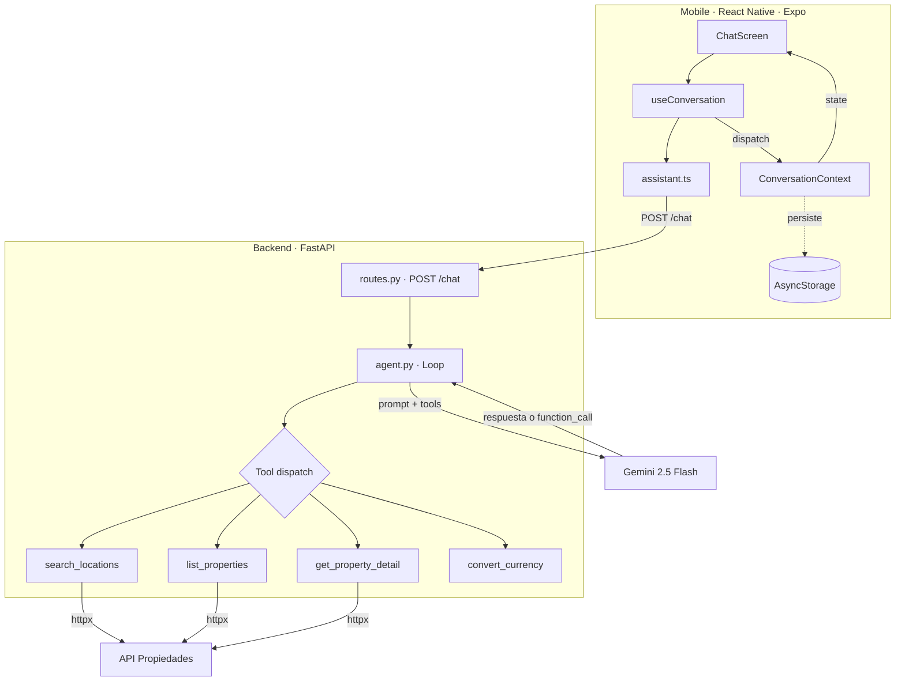
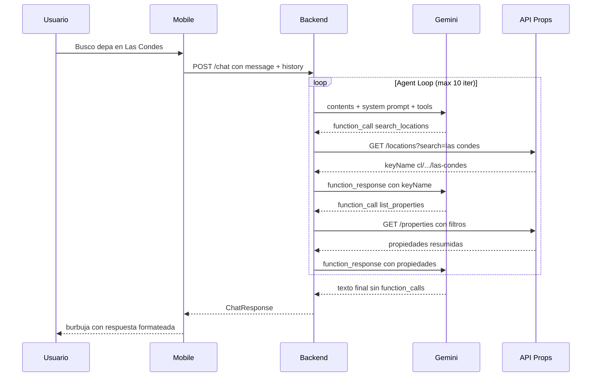

# PropAssist AI

Asistente inmobiliario conversacional con IA que busca propiedades reales a través de function calling.

**Backend:** FastAPI + Gemini 2.5 Flash (function calling nativo) · **Mobile:** React Native + Expo SDK 54 (TypeScript)

---

## Arquitectura



> El Agent Loop itera hasta 10 veces: Gemini puede pedir múltiples tools en secuencia
> (ej: `search_locations` → `list_properties` → `get_property_detail`) antes de generar la respuesta final.

### Flujo de una consulta



---

## Estructura del proyecto

```
├── backend/                     # FastAPI + Gemini + Function Calling
│   ├── app/
│   │   ├── main.py              # Entry point, CORS, /health
│   │   ├── config.py            # Settings vía .env (Pydantic)
│   │   ├── api/routes.py        # POST /chat endpoint
│   │   ├── core/
│   │   │   ├── agent.py         # Loop agentico: Gemini ↔ tools (max 10 iter, retry con backoff)
│   │   │   ├── prompts.py       # System prompt del asistente inmobiliario
│   │   │   └── tools.py         # 4 FunctionDeclarations para Gemini
│   │   ├── schemas/             # Pydantic: ChatRequest, ChatResponse, Message
│   │   └── services/
│   │       └── properties.py    # Cliente HTTP async → API propiedades + convert_currency
│   ├── tests/                   # Unit + integration tests
│   ├── Dockerfile               # python:3.11-slim
│   ├── docker-compose.yml       # Alternativa sin instalar Python
│   └── requirements.txt
│
├── mobile/                      # React Native + Expo SDK 54
│   ├── app/
│   │   ├── _layout.tsx          # Root: ConversationProvider + Stack
│   │   └── index.tsx            # Pantalla principal del chat
│   ├── components/
│   │   ├── MessageBubble.tsx    # Burbuja con formato (bold, URLs clickeables)
│   │   ├── MessageList.tsx      # FlatList con auto-scroll
│   │   ├── InputBar.tsx         # Input + botón enviar (animado)
│   │   ├── Header.tsx           # Título + botón "Nuevo chat" con confirmación
│   │   ├── TypingIndicator.tsx  # 3 dots animados (reanimated)
│   │   ├── ErrorBanner.tsx      # Banner rojo con retry/dismiss
│   │   └── SuggestionChips.tsx  # Chips iniciales: "Deptos en La Reina", etc.
│   ├── context/
│   │   └── ConversationContext.tsx  # useReducer + AsyncStorage (persistencia)
│   ├── hooks/
│   │   └── useConversation.ts   # send/retry/clear + AbortController + haptics
│   ├── services/
│   │   └── assistant.ts         # POST /chat con timeout 60s y error handling
│   ├── types/conversation.ts    # Message, Role, ConversationState
│   └── constants/config.ts      # URL dinámica por plataforma (web/iOS/Android)
│
└── README.md
```

---

## Setup

### Requisitos

| Herramienta | Versión | Para qué |
|-------------|---------|----------|
| Docker | 20+ | Backend (contenedor Python + FastAPI) |
| Node.js | 18+ | Frontend mobile (Expo dev server) |
| Expo Go | Última | Ejecutar la app en celular físico |

### 1. Backend (Docker)

```bash
cd backend
docker compose up --build
```

Listo. El backend queda corriendo en `http://localhost:8000` con hot-reload incluido.

Verificar: `http://localhost:8000/health` → `{"status":"ok"}`

> El `.env` con API keys ya está incluido. Para recrearlo: copiar `.env.example` y completar `GEMINI_API_KEY`, `PROPERTIES_API_URL` y `PROPERTIES_API_TOKEN`.

<details>
<summary>Alternativa sin Docker (Python local)</summary>

```bash
cd backend
python -m venv venv

# Windows PowerShell:  .\venv\Scripts\Activate.ps1
# macOS/Linux/Git Bash: source venv/bin/activate

pip install -r requirements.txt
uvicorn app.main:app --host 0.0.0.0 --port 8000
```

</details>

### 2. Mobile (Expo)

En otra terminal:

```bash
cd mobile
npm install --legacy-peer-deps
npx expo start
```

| Plataforma | Instrucción |
|------------|-------------|
| Web | Presionar `w` → se abre `http://localhost:8081` |
| iPhone | Escanear QR con la cámara (requiere Expo Go + misma red WiFi) |
| Android | Presionar `a` o escanear QR desde Expo Go |

> **Nota:** El backend corre con `--host 0.0.0.0` (ya configurado en Docker) para que el celular pueda conectarse. La app detecta la IP del PC automáticamente.

### ¿Por qué solo el backend está dockerizado?

El backend es un servidor API stateless — Docker lo encapsula perfecto: Python, dependencias y `.env` en un solo `docker compose up`.

El frontend mobile **no se puede dockerizar de forma práctica** porque Expo Go necesita comunicación directa con el host: escaneo de QR, hot reload vía WebSocket, y acceso a la red local para que el celular encuentre el dev server. Meter esto en un contenedor requeriría exponer múltiples puertos, configurar network_mode=host, y perdería las ventajas de Docker sin ganar nada. El dev server de Expo está diseñado para correr directamente en la máquina del desarrollador.

---

## Decisiones técnicas

### LLM: Gemini 2.5 Flash

Elegí Gemini por tres razones:

1. **Function calling nativo** — El SDK `google-genai` soporta tool use integrado. El modelo decide cuándo consultar la API de propiedades sin parsear JSON manualmente. Esto simplifica el loop agentico: Gemini recibe las definiciones de 4 tools, llama las que necesita, recibe los resultados, y genera la respuesta final.

2. **Tier gratuito generoso** — A diferencia de GPT-4o-mini (free trial limitado) o Claude Haiku (tier más restrictivo), Gemini ofrece uso gratuito suficiente para desarrollo y demostración.

3. **Baja latencia** — Flash está optimizado para velocidad, crítico para UX conversacional donde cada segundo de espera se siente.

**Trade-off considerado:** Groq (Llama 3.1) tiene latencia aún menor, pero su soporte de function calling es menos maduro y requiere parsing manual de las llamadas a herramientas.

### Backend: FastAPI + httpx

- **FastAPI**: async nativo, validación automática con Pydantic, documentación OpenAPI generada — ideal para un backend que hace llamadas HTTP concurrentes (API propiedades + LLM).
- **httpx**: cliente HTTP async con API idéntica a `requests`. Elegido sobre `aiohttp` por su API más limpia.
- **Pydantic**: validación estricta de `ChatRequest` (message 1-2000 chars + history) y `ChatResponse`.

### Frontend: Expo SDK 54 + Context + useReducer

- **Expo Router**: file-based routing. Para una app de una pantalla es suficiente y deja la puerta abierta a más pantallas sin refactor.
- **Context + useReducer**: estado del chat (messages, loading, error) con 5 acciones predecibles (`ADD_MESSAGE`, `SET_LOADING`, `SET_ERROR`, `LOAD`, `CLEAR`). No hay múltiples stores cruzados, ni middleware, ni estado compartido entre pantallas — `useReducer` resuelve esto sin dependencias externas. Si la app creciera a múltiples pantallas con estado compartido complejo, ahí migrar a Zustand tendría sentido.
- **StyleSheet nativo**: sin NativeWind. Para una UI de chat con pocos componentes, StyleSheet ofrece rendimiento óptimo sin overhead de configuración.

### ¿Por qué no SSR ni SEO?

**SSR** (Server-Side Rendering) es un concepto web donde el servidor pre-renderiza HTML para carga rápida e indexación. Esta app es **React Native** — renderiza componentes nativos directamente en el dispositivo, no hay HTML ni browser. SSR no existe como concepto en apps nativas.

**SEO** requiere contenido público indexable. Esta app es un **chat privado** — cada conversación es única del usuario, no hay URLs públicas ni contenido que Google deba indexar. Por la misma razón que WhatsApp no necesita SEO.

**¿Cuándo sí aplicarían?** Si se construyera un portal web público de propiedades con URLs indexables (ej: `propassist.com/propiedades/las-condes`), ahí sí se necesitaría SSR + SEO — pero sería un proyecto separado (Next.js), no esta app de chat.

---

## Decisiones de UX

La interfaz sigue el patrón de **app de mensajería** (WhatsApp, iMessage) por familiaridad — el usuario ya sabe cómo funciona un chat.

| Decisión | Por qué |
|----------|---------|
| **Burbujas diferenciadas** (azul usuario, gris IA) | Distinción visual inmediata. Colores convencionales de apps de mensajería. |
| **Typing indicator** (3 dots animados) | Feedback visual mientras la IA procesa. Elegido sobre spinner porque se siente más conversacional. |
| **Suggestion chips al inicio** | Reducen la fricción del "¿qué le pregunto?". Desaparecen al iniciar la conversación. |
| **Error banner con retry** | Banner inline que muestra el error y ofrece reintentar sin perder contexto (en vez de un alert modal). |
| **Persistencia (AsyncStorage)** | La conversación se guarda automáticamente. Si el usuario cierra la app, encuentra su conversación al volver. |
| **Haptic feedback** | Vibración sutil al enviar y recibir mensajes. Refuerza la interactividad en mobile. |
| **Auto-scroll** | Scroll automático al final al recibir mensaje nuevo. |
| **Max width 600px en web** | En desktop, el chat se centra para mantener legibilidad. |

---

## ¿Qué mejoraría con 1 semana más?

### Streaming (SSE)
Respuestas palabra por palabra en tiempo real con Server-Sent Events. El usuario empieza a leer antes de que termine la generación — reduce drásticamente la percepción de latencia.

### Tarjetas de propiedades
En vez de texto plano, **tarjetas con imagen, precio, ubicación y características** directamente en el chat. Evaluación visual de propiedades de un vistazo.

### Mapa interactivo
Google Maps o Mapbox mostrando la ubicación de las propiedades encontradas. Tap para ver detalles.

### Historial de conversaciones
Múltiples conversaciones guardadas con sidebar. Actualmente se persiste una sola conversación.

### Búsqueda por voz
Reconocimiento de voz (Expo Speech/Whisper) para dictar la búsqueda. Especialmente útil en mobile.

### Tests E2E
Detox (mobile) + Pytest con httpx (backend). Cubrir flujos completos: "busca propiedad → recibe resultados → pide detalles".

### Caché inteligente
Cachear respuestas de la API de propiedades para búsquedas frecuentes. Redis o TTL cache en memoria.

### Dark mode
Tema oscuro respetando preferencias del SO con `useColorScheme()`.

### Deploy en nube y multi-tenancy
Actualmente el backend corre local con Docker. Para servir a múltiples clientes simultáneos: deploy en un servicio como Cloud Run o AWS ECS, base de datos (PostgreSQL) para persistir conversaciones por usuario, y autenticación (JWT o similar) para aislar sesiones. El backend ya es stateless por request — escala horizontalmente sin cambios en la lógica del agent.

### Historial multi-conversación
Hoy se persiste una sola conversación en AsyncStorage (client-side). Con un backend persistente, cada usuario tendría múltiples conversaciones guardadas con título auto-generado, listadas en un sidebar. Requiere modelo de datos (users, conversations, messages) y migrar la persistencia del cliente al servidor.
