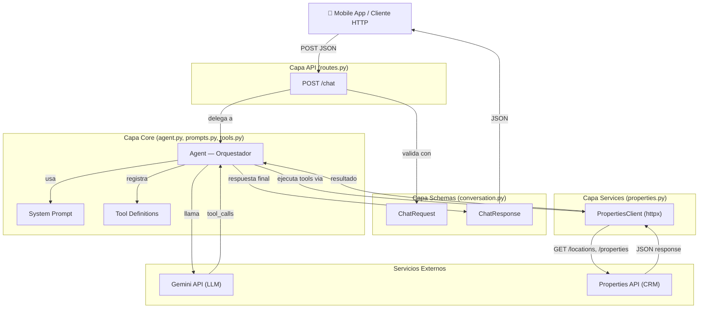
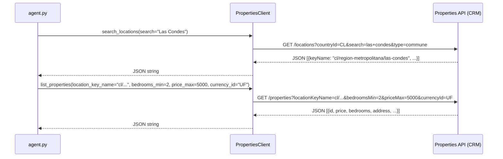
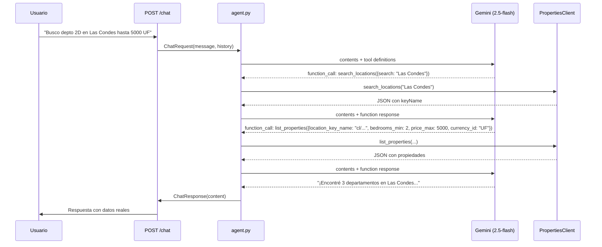

# PropAssist AI — Backend

> Asistente inmobiliario inteligente con function calling, conectado a datos reales de Property Partners.

---

## 1. Arquitectura de carpetas

```
backend/
├── app/
│   ├── __init__.py
│   ├── main.py              # FastAPI app, CORS, health check
│   ├── config.py             # Pydantic Settings (.env)
│   ├── api/
│   │   ├── __init__.py
│   │   └── routes.py         # POST /chat endpoint
│   ├── core/
│   │   ├── __init__.py
│   │   ├── agent.py          # Orquestador LLM + function calling loop
│   │   ├── prompts.py        # System prompt del asistente
│   │   └── tools.py          # Definiciones de herramientas (Gemini format)
│   ├── schemas/
│   │   ├── __init__.py
│   │   └── conversation.py   # Pydantic models (Request/Response)
│   └── services/
│       ├── __init__.py
│       └── properties.py     # Cliente HTTP → Properties API
├── tests/
│   ├── test_agent.py         # Tests de integración del agente
│   ├── test_properties.py    # Tests del cliente HTTP
│   └── test_schemas.py       # Tests de validación Pydantic
├── .env                      # Variables de entorno (no versionado)
├── requirements.txt          # Dependencias Python
├── Dockerfile                # Imagen Docker del backend
├── docker-compose.yml        # Orquestación con Docker Compose
└── BACKEND.md                # Este archivo
```

---

## 2. Arquitectura por capas

El backend sigue una arquitectura **layered (por capas)** con responsabilidades bien separadas:



### Responsabilidad de cada capa

| Capa | Archivos | Responsabilidad |
|------|----------|-----------------|
| **API** | `api/routes.py` | Recibir requests HTTP, validar, delegar al core, manejar errores |
| **Core** | `core/agent.py`, `core/prompts.py`, `core/tools.py` | Lógica de negocio: orquestación del LLM, definición de herramientas, prompt engineering |
| **Schemas** | `schemas/conversation.py` | Modelos de datos (Pydantic): validación de entrada/salida |
| **Services** | `services/properties.py` | Comunicación con APIs externas (Properties API via HTTP) |
| **Config** | `config.py` | Configuración centralizada desde variables de entorno |

---

## 3. Modelo de lenguaje

### Modelo seleccionado: `gemini-2.5-flash` via Google Gemini

| Atributo | Valor |
|----------|-------|
| **Modelo** | `gemini-2.5-flash` |
| **Proveedor** | Google Gemini |
| **SDK** | `google-genai` |
| **Free tier** | Generoso (suficiente para desarrollo y demostración) |
| **Function calling** | Nativo, integrado en el SDK |

### Configuración

El modelo es configurable via variable de entorno, sin cambiar código:

```env
GEMINI_API_KEY=your_key_here
```

```python
# config.py
class Settings(BaseSettings):
    gemini_api_key: str
    llm_model: str = "gemini-2.5-flash"
```

---

## 4. Conexión a la API de propiedades

El backend consulta datos reales de propiedades desde la API REST del CRM de Property Partners.



### Detalles de conexión

| Atributo | Valor |
|----------|-------|
| **Base URL** | `https://crm-api-dev.ppartnersgroup.com/crm/public/v2` |
| **Autenticación** | Bearer token (`Authorization: Bearer <token>`) |
| **Cliente HTTP** | `httpx.AsyncClient` (async, con timeout configurable) |
| **Timeout** | 30 segundos (configurable via `REQUEST_TIMEOUT`) |
| **Formato de respuesta** | JSON serializado a string (pasado directamente al LLM como tool result) |

### Endpoints consumidos

| Método | Endpoint | Uso |
|--------|----------|-----|
| `GET` | `/locations` | Buscar comunas/barrios por nombre → obtener `keyName` |
| `GET` | `/properties` | Listar propiedades con filtros (ubicación, tipo, precio, dormitorios) |
| `GET` | `/properties/{id}` | Detalle completo de una propiedad específica |

---

## 5. Function calling

### Concepto

El LLM no accede directamente a la API de propiedades. En su lugar, se le definen **herramientas** (tools) que puede invocar cuando lo considere necesario. El backend actúa como orquestador:



### Las 3 herramientas

Las herramientas están definidas usando `google.genai.types.FunctionDeclaration`, el formato nativo de Gemini:

| # | Herramienta | Propósito | Parámetros clave |
|---|-------------|-----------|------------------|
| 1 | `search_locations` | Buscar ubicaciones → obtener `keyName` | `search` (requerido), `country_id`, `location_type` |
| 2 | `list_properties` | Listar propiedades con filtros | `location_key_name`, `property_type`, `operation`, `bedrooms_min`, `price_max`, `currency_id` |
| 3 | `get_property_detail` | Detalle completo de una propiedad | `property_id` (requerido) |

### Flujo orquestado (agent loop)

```python
# Simplificado de agent.py
for _ in range(MAX_TOOL_ITERATIONS):       # máx 10 iteraciones
    response = client.models.generate_content(
        model="gemini-2.5-flash",
        contents=contents,
        config=config,                      # system prompt + tools
    )

    if not function_calls:
        break                               # respuesta final, salir del loop

    for fc in function_calls:
        result = execute_tool(fc)           # llama a PropertiesClient
        contents.append(function_response)  # agrega resultado al contexto

    # siguiente iteración: LLM ve los resultados y decide si necesita más tools
```

### Resiliencia

| Mecanismo | Detalle |
|-----------|---------|
| **Retry con backoff** | 3 reintentos en errores 429/503/500 (rate limit), con delays de 15s, 30s, 60s |
| **Coerción de tipos** | `_coerce_args()` convierte strings a int/float cuando el LLM envía tipos incorrectos |
| **Máx. iteraciones** | El loop se detiene tras 10 ciclos para evitar loops infinitos |
| **Tool dispatch seguro** | Solo se ejecutan herramientas registradas en `TOOL_DISPATCH` |
| **Quota diaria** | Detección de PerDay quota — falla inmediatamente sin reintentar |

---

## 6. System prompt

El system prompt instruye al LLM sobre su comportamiento. Puntos clave:

| Instrucción | Detalle |
|-------------|---------|
| **Idioma** | Siempre responder en español |
| **Flujo de tools** | `search_locations` → `list_properties` → `get_property_detail` (en orden) |
| **Datos reales** | Nunca inventar propiedades; usar solo datos de las herramientas |
| **Off-topic** | Rechazar cortésmente preguntas no inmobiliarias |
| **Formato** | Conversacional, conciso, con datos clave (precio, dirección, m², dormitorios) |
| **URLs** | Incluir link de la propiedad cuando esté disponible |
| **Tono** | Profesional pero cercano, como un asesor inmobiliario real |
| **Cierre** | Siempre sugerir una acción siguiente al usuario |

---

## 7. Paquetes utilizados

| Paquete | Uso |
|---------|-----|
| `fastapi` | Framework web async |
| `uvicorn[standard]` | Servidor ASGI |
| `google-genai` | SDK para Google Gemini API |
| `httpx` | Cliente HTTP async para Properties API |
| `pydantic` | Validación de datos y schemas |
| `pydantic-settings` | Configuración desde `.env` |
| `python-dotenv` | Carga de variables de entorno |

---

## 8. Cómo ejecutar

### Opción A: Local (desarrollo)

```bash
cd backend
python -m venv venv
source venv/bin/activate        # Windows: venv\Scripts\activate
pip install -r requirements.txt
cp .env.example .env            # configurar API keys
uvicorn app.main:app --reload --port 8000
```

### Opción B: Docker (producción / demo)

```bash
cd backend
cp .env.example .env            # configurar API keys
docker compose up --build
```

### Verificar que funciona

```bash
# Health check
curl http://localhost:8000/health
# → {"status": "ok"}

# Chat
curl -X POST http://localhost:8000/chat \
  -H "Content-Type: application/json" \
  -d '{"message": "Hola, busco un departamento en Las Condes", "history": []}'
```

---

## 9. Variables de entorno

| Variable | Requerida | Descripción |
|----------|-----------|-------------|
| `GEMINI_API_KEY` | Sí | API key de Google Gemini |
| `PROPERTIES_API_URL` | Sí | URL base de la API de propiedades |
| `PROPERTIES_API_TOKEN` | Sí | Bearer token para la API de propiedades |
| `LLM_MODEL` | No | Modelo LLM (default: `gemini-2.5-flash`) |
| `REQUEST_TIMEOUT` | No | Timeout HTTP en segundos (default: `30.0`) |
